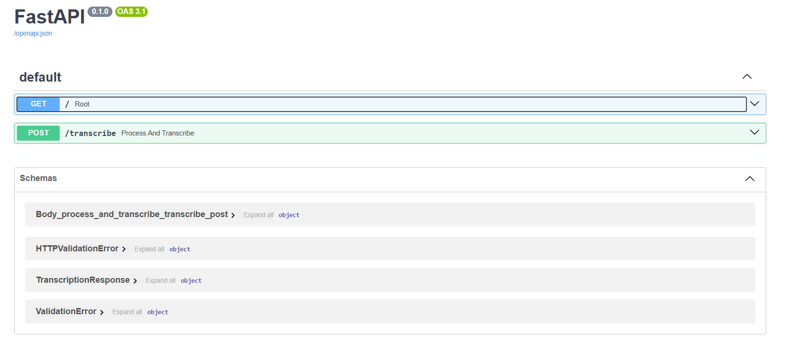
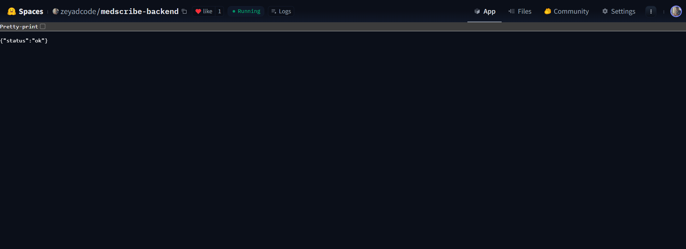
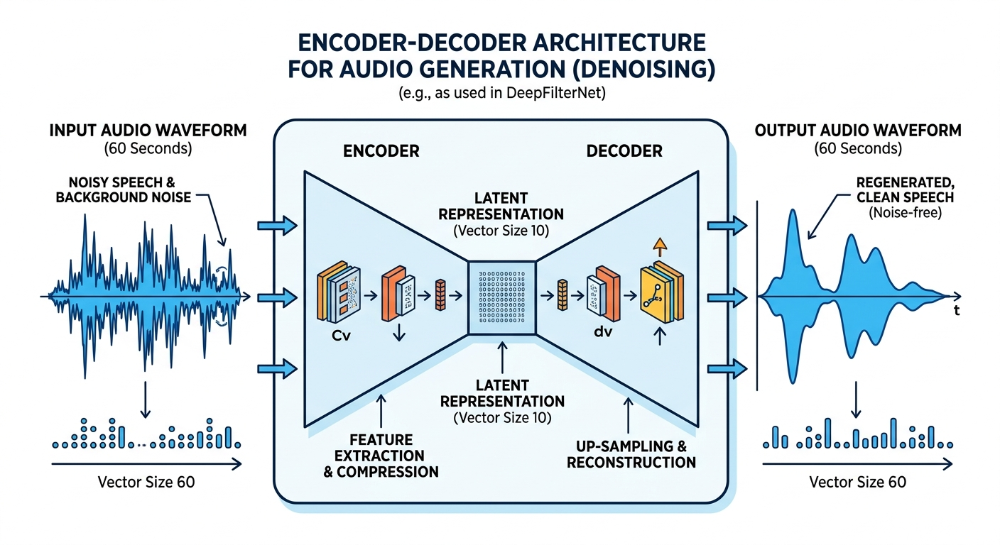
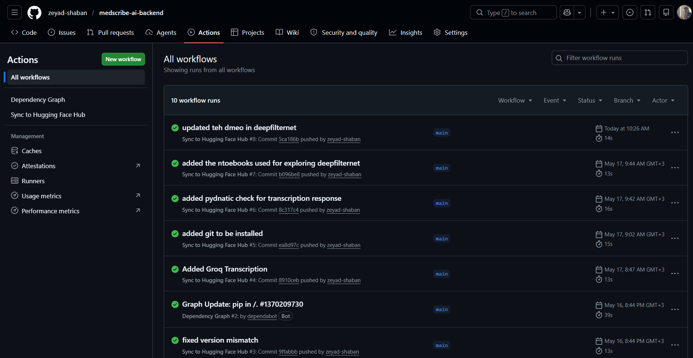
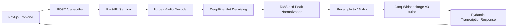

# Medscribe AI Backend

[](https://fastapi.tiangolo.com/)
[](https://www.python.org/)
[](https://www.docker.com/)
[](https://huggingface.co/spaces/zeyadcode/medscribe-backend)

This repository contains the audio transcription backend for Medscribe AI, an AI medical scribe that records doctor-patient conversations, transcribes them, and generates structured follow-up summaries.

The backend is a Dockerized FastAPI service hosted on Hugging Face Spaces. It accepts audio uploads, improves audio quality with a denoising and normalization pipeline, sends the processed audio to Groq Whisper, and returns a typed JSON transcription response to the Next.js frontend.

Demo Video: [YouTube walkthrough](https://youtu.be/qco3Urdr8m8)

<a href="https://youtu.be/qco3Urdr8m8">
  
</a>

## Related Links

- Backend Space: [huggingface.co/spaces/zeyadcode/medscribe-backend](https://huggingface.co/spaces/zeyadcode/medscribe-backend)
- Production API: [zeyadcode-medscribe-backend.hf.space](https://zeyadcode-medscribe-backend.hf.space)
- Frontend App: [medscribe-ai-lilac.vercel.app/dashboard](https://medscribe-ai-lilac.vercel.app/dashboard)
- Frontend Repository: [zeyad-shaban/medscribe-ai-frontend](https://github.com/zeyad-shaban/medscribe-ai-frontend)
- Backend Repository: [zeyad-shaban/medscribe-ai-backend](https://github.com/zeyad-shaban/medscribe-ai-backend)
- Demo Video: [YouTube walkthrough](https://youtu.be/qco3Urdr8m8)

<a href="https://youtu.be/qco3Urdr8m8">
  
</a>

## Screenshots

Add backend screenshots or diagrams to `docs/assets/` using these filenames. The README is already wired to render them once the files are added.

| API Docs | Hugging Face Space |
| --- | --- |
|  |  |

| Audio Pipeline | CI/CD |
| --- | --- |
|  |  |

## What It Does

- Exposes a FastAPI `/transcribe` endpoint for audio upload.
- Loads uploaded audio with `librosa`.
- Applies DeepFilterNet denoising before transcription.
- Normalizes RMS level and protects against clipping.
- Resamples audio to 16 kHz for the Groq transcription API.
- Sends cleaned audio to `whisper-large-v3-turbo` through Groq.
- Returns a Pydantic-validated JSON response with transcript text, filename, and duration.
- Runs as a Docker container on Hugging Face Spaces.
- Uses GitHub Actions to sync the repository to Hugging Face Hub after pushes to `main`.

## Engineering Highlights

- Production-style API boundary between the web app and transcription service.
- Audio preprocessing pipeline designed to improve transcription quality before calling the speech-to-text model.
- Containerized deployment with a Hugging Face-compatible Dockerfile and port configuration.
- Typed response schema with Pydantic for predictable frontend integration.
- CI/CD workflow that pushes backend updates from GitHub to Hugging Face Hub.
- Built as part of a solo full-stack AI project covering frontend, backend, AI orchestration, deployment, and infrastructure.

## Architecture



## Tech Stack

| Area | Technology |
| --- | --- |
| API framework | FastAPI |
| Runtime | Python 3.10 |
| Data validation | Pydantic |
| Audio loading/resampling | librosa, scipy |
| Audio denoising | DeepFilterNet |
| ML/audio runtime | PyTorch, torchaudio |
| Speech-to-text | Groq Whisper `whisper-large-v3-turbo` |
| Deployment | Docker on Hugging Face Spaces |
| CI/CD | GitHub Actions, `huggingface/hub-sync` |

## API Reference

### Health Check

```http
GET /
```

Response:

```json
{
  "status": "ok"
}
```

### Transcribe Audio

```http
POST /transcribe
Content-Type: multipart/form-data
```

Form field:

| Name | Type | Description |
| --- | --- | --- |
| `file` | audio file | Audio conversation file to clean and transcribe. |

Example response:

```json
{
  "transcript": "Patient reported...",
  "filename": "consultation.wav",
  "duration_seconds": 42.7
}
```

## Local Development

### Prerequisites

- Python 3.10
- ffmpeg
- Groq API key

### Setup

```bash
python -m venv .venv
.venv\Scripts\activate
pip install -r requirements.txt
uvicorn app:app --reload --host 127.0.0.1 --port 8000
```

On macOS/Linux, activate the virtual environment with:

```bash
source .venv/bin/activate
```

Create `.env.local`:

```bash
GROQ_SECRET_KEY=
```

Open [http://127.0.0.1:8000/docs](http://127.0.0.1:8000/docs) to test the FastAPI endpoint.

## Docker

Build and run locally:

```bash
docker build -t medscribe-ai-backend .
docker run --env-file .env.local -p 7860:7860 medscribe-ai-backend
```

The container listens on port `7860`, which is the expected port for Hugging Face Spaces Docker apps.

## CI/CD

The repository includes a GitHub Actions workflow at `.github/workflows/sync-to-hub.yml`.

On every push to `main`, the workflow:

1. Checks out the repository.
2. Enables Git LFS support.
3. Pushes the backend code to the Hugging Face Space using `huggingface/hub-sync`.

Required GitHub secret:

```bash
HF_TOKEN=
```

## Project Structure

```text
.
  app.py
  Dockerfile
  requirements.txt
  config/
    constants.py
    settings.py
  schemas/
    transcription.py
  utils/
    audio_cleaning.py
  notebooks/
    eda.ipynb
    deepfilternet_demo.ipynb
  .github/
    workflows/
      sync-to-hub.yml
```

## Roadmap

- Add speaker separation before or after transcription.
- Add automated tests before syncing to Hugging Face.
- Host more AI model logic directly on Hugging Face.
- Add automatic model switching and fallback behavior during API spikes.
- Expand observability around transcription latency and failure modes.

## Clinical Safety Scope

Medscribe AI is built as an AI-assisted documentation workflow. The backend provides transcription support for clinician review and should not be treated as a medical device or official medical record system by itself.
